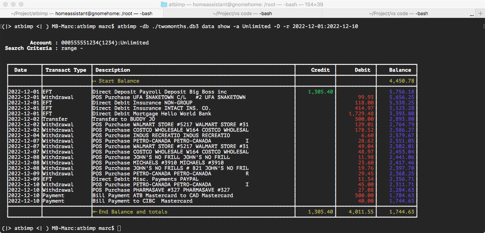

# Will allow you to import ATB csv files and list transactions

## Introduction

**atbimp** is a python based command line utility to check, modify and sanitize **ATB** downloaded csv files. **ATB** ***(Alberta Tresury Branch)*** is a local goverment owned bank in Alberta. One of the features in it's electroninc banking is the download of transactions in the CSV format. Sounds great! Now you can import this into your own sql-like database. However ... as with many CSV files the formats is not well specified and in the case of **ATB** quite inconsistant and messy at best. Even though most spreadsheat programs I've tried are rather forgiving **sqlite3** was definetaly not!

### Checks and Fixes

When using the `csv check` or `csv import` options, `atbimp` will first attemt to figure out the date format used in the file. Apparently **ATB** seemed pretty inconsistant in their date formating between accounts and also between *Private banking* side and the *Business banking*. `M/D/Y` or `D/M/Y`. Sometimes with leading `0` sometimes without. 

After that the folowing 4 checks/fixes are executed on each line of input:
1. date incorrect format: month and days<10 are sometimes not prefixed with a 0 and some files do m/d/y others do d/m/y
2. Customer_Ref_Number (field:4) is sometimes preceded with a single (') without a closing quote.
3. The header has 10 fields, where as some data lines have a trailing (,) thus generating 11 fields.
4. The description (field:8) may contain single quotes.  Since none of the fields in the csv file are quoted, this is a trainwreck waiting to happen.  

### Design and Usage

#### Design
The `atbimp` program is written in python using [Cement 3.0](https://github.com/datafolklabs/cement) as a MVC framework. It includes unit-tests and some ***fake*** test data. It should work cross-platform, however I've only tested it on MacOS and Linux ***(Debian)***. I don't have Windows available and did not yet go the docker-route.  The instructions below regarding Installation and Development are auto generated from the **Cement** framework.

#### usage 

**ATB** is just a small local bank, so not a big audience here. However the program might be usefull for other CSV files and/or other bank software.  Use at your own descretion. 


    (|> atbimp <| ) MB-Marc:atbimp marc$ atbimp -h
    usage: atbimp [-h] [-d] [-q] [-v] [-db DB] {imports,imp,accounts,act,data,dat,csv} ...

        Will allow you to import ATB csv files and list transactions

        1) Check, fix and import your csv files using the 'csv' sub commands'
        2) Optionally you can assign nick-names to the accounts imported using 
        'act' command.
        3) After import check for duplicates or false positives and decide to 
        import them after all.
        4) display months, date ranges or find a specific amount or part of the
        description using the csv data commands.

    options:
    -h, --help            show this help message and exit
    -d, --debug           full application debug mode
    -q, --quiet           suppress all console output
    -v, --version         show program's version number and exit
    -db DB                database file to use. (default transactions.db3)

    sub-commands:
    {imports,imp,accounts,act,data,dat,csv}
        imports (imp)       commands to examine and/or roll-back imports from `csv import ...'
        accounts (act)      Commands for listing imported accounts and change nick name.
        data (dat)          Commands for displaying and lookup entries in the datbase that where imported by the 'csv import' command
        csv                 Commands for checking, importing and fixing ATB csv files.

 
#### Screenshot



## License
GNU LESSER GENERAL PUBLIC LICENSE Version 3.0 
***If you're a developer for a bank, please contact me.*** 😉


## Installation

```
$ pip install -r requiremennts.txt

$ python setup.py install
```

### Alternate instalation dealing with "Externaly Managed Enviroment" Pip Error
[See here for details](https://www.makeuseof.com/fix-pip-error-externally-managed-environment-linux/)
```
$ make virtualenv
$ source env/bin/activate
$ make test 
$ sqlite3 transactions.db3 < tests/twomonths.db3.sql
$ atbimp imp ls
$ atbimp data show -nb -a Unlimited -r 2022-11-01:2022-11-10
```
Happy hunting! 😉

## Development

This project includes a number of helpers in the `Makefile` to streamline common development tasks.

### Environment Setup

The following demonstrates setting up and working with a development environment:

```
### create a virtualenv for development

$ make virtualenv

$ source env/bin/activate


### run atbimp cli application

$ atbimp --help


### run pytest / coverage

$ make test
```


### Releasing to PyPi

Before releasing to PyPi, you must configure your login credentials:

**~/.pypirc**:

```
[pypi]
username = YOUR_USERNAME
password = YOUR_PASSWORD
```

Then use the included helper function via the `Makefile`:

```
$ make dist

$ make dist-upload
```

## Deployments

### Docker

Included is a basic `Dockerfile` for building and distributing `ATB CSV Import and List Application`,
and can be built with the included `make` helper:

```
$ make docker

$ docker run -it atbimp --help
```
